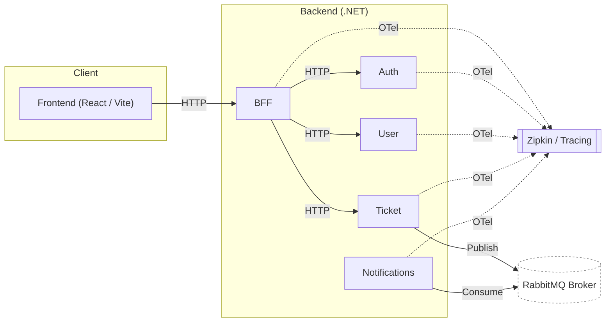

# 🎟️ Ticketing System

## Project Overview

Ticketing System is a simple yet robust ticket management platform built using Clean Architecture with a .NET 9 backend and a modern React frontend (Vite).

The solution includes:

* **Backend Microservices Architecture** (`Ticketing`, .NET 9)
* **Frontend SPA** (`Ticketing`, React + Vite)
* **Infrastructure** (Entity Framework Core, SQLite for local/dev)
* **Observability** (OpenTelemetry + Zipkin for distributed tracing)
* **Unit tests** (backend)
* **Container orchestration** via Docker Compose for easy setup

---

## Architecture Diagram



**Legend:**
- **Solid lines** → HTTP communication  
- **Publish/Consume arrows** → Messaging via RabbitMQ  
- **Dashed lines** → OpenTelemetry traces to Zipkin  
---

## Setup Instructions

### Prerequisites

* [.NET 8 SDK](https://dotnet.microsoft.com/)
* [Node.js](https://nodejs.org/) (for frontend development, not needed for Docker)
* [Docker & Docker Compose](https://docs.docker.com/get-docker/) (recommended)
* **(Optional):** GitHub/GitLab account for private repository

---

### 1. Clone the Repository

```bash
git clone <your-private-repo-url>
cd Ticketing
```

---

### 2. Configuration

#### Backend

* For local development, edit your secrets or configuration file with the following recommended settings:

  ```json
  {
    "RepositoryConnection": "Data Source=Ticketing.db",

    // OpenTelemetry configuration
    "PropertiesToTrace": [ "Id" ],
    "TraceContents": "false",
    "ServiceName": "TicketService",
    "ExcludedPaths": [ "swagger", "health" ],
    "AgentHost": "localhost",
    "AgentPort": "9411",

    // Logging configuration
    "MinimumLevel": "Verbose",
    "Sink": "Console",
    "FilePath": "Logs/TicketService.log"
  }
  ```

  *These values are used by default when running with Docker Compose, but can be overridden for local development.*

* **OpenTelemetry & Zipkin Configuration:**

  * By default, OpenTelemetry tracing is enabled and configured to export traces to Zipkin on `localhost:9411`.
  * In Docker Compose, `AgentHost` should be set to `zipkin` and `AgentPort` to `9411`.

#### Frontend

* For local development, edit or create `Frontend/.env`:

  ```env
  VITE_API_BASE_URL=https://localhost:7086
  ```

---

### 3. Running the App

#### Option A: Docker Compose (Recommended)

This will run **backend, frontend, rabbitMQ, and Zipkin** for observability, using SQLite for persistence.

```bash
docker compose up --build
```

* **Frontend**: [http://localhost:3000](http://localhost:3000)
* **Backend BFF**: [http://localhost:500](http://localhost:8080)
* **Zipkin UI** (tracing): [http://localhost:9411](http://localhost:9411)
* **RabbitMQ** (messaging): [http://localhost:15672](http://localhost:15672)

---

## Authentication

To access the application, use one of the default users:

* **admin/1234**
* **alice/1234**

---

## Assumptions

* SQLite is used for local development and when running via Docker by default. No external DB configuration required unless specified.
* The frontend expects the backend API URL to be set via `VITE_API_BASE_URL` (in `.env` for local dev or as a build arg for Docker).
* All migrations are automatically applied on startup when using Docker.
* OpenTelemetry and Zipkin are enabled by default for distributed tracing.

---

## Observability & Tracing

**Distributed tracing is enabled with OpenTelemetry and Zipkin.**

* All API calls and relevant internal operations are traced.
* You can inspect end-to-end request traces via the Zipkin UI ([http://localhost:9411](http://localhost:9411)).
* Configuration for Zipkin endpoint is set in Docker Compose or via environment variables or your `secrets` file (see above).
* Modify these values if you need to connect to an external Zipkin instance.

---

## How to Run the Tests

**Backend tests:**

```bash
cd Backend/tests/Ticketing.Tests
dotnet test
```

**Frontend tests:**

If not implemented.

---

## SQLite Setup Notes

* **Docker:** The APIs uses a local SQLite file located at `/app/db.db` inside the container.
* **Local development:** If no connection string is set, defaults to a `db.db` file in the project folder.
* To inspect the DB, you can open the `.db` file with [DB Browser for SQLite](https://sqlitebrowser.org/) or similar tools.

---

## Available Endpoints

Sample RESTful endpoints:

* `GET /api/ticket` – List all tickets
* `GET /api/ticket/{id}` – Get ticket by ID
* `POST /api/ticket` – Create a new ticket
* `PUT /api/ticket/{id}` – Update ticket
* `DELETE /api/ticket/{id}` – Delete ticket
* `GET /api/user/{username}` – Get user by UserName

---
